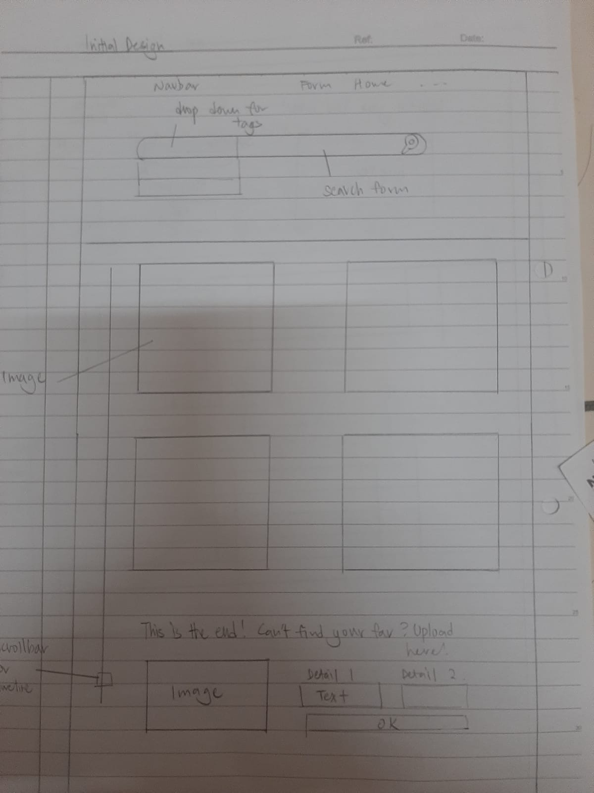
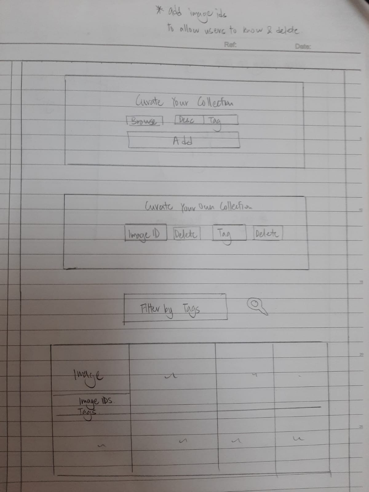

# Design Journey

## Target Audience

- My target audience is 20 to 30 year olds women who are looking for outfits for various occasions or daily inspiration to step up their fashion game

## Design Process

Final deisgn

## Design Patterns

- Search bar is placed on top of the images so that users understand that they would be searching there to look for a particular image in the following gallery

- For familarity, tags are labelled with a '#' to look like hashtags from social media platforms

- For familarity, a magnifying glass icon is used to submit a search query from the search form

-To look for more images, users simply have to scroll down, which is a common design pattern in similar image galleries

## Database Schema Design

images (
id : INTEGER {PK, U, Not, AI}
tag_id : INTEGER
date : DATE
)

tags (
id : INTEGER {PK, U, Not, AI}
name : TEXT
)

original poster (
id : INTEGER {PK, U, Not, AI}
name : TEXT
comment : TEXT
contribution : INTEGER
)

## Gallery Flow

Viewing all images in your gallery:

1. Scroll down when you are at index.php
2. The images are numbered for users to know the image IDs

View all images for a tag:

1. Select the tag from the select dropdown
2. Click the search button which looks like a magnifying glass

View a single image and all the tags for that image:

1. Click on the image that you wish to view
2. The tags are shown after each '#' and description after each '&'

How to upload a new image:

1. Select your file
2. Enter any tag and description
3. Click the add button

How to delete an image:

1. The delete form is the second form on the page
2. Enter the imageID and click the button delete

How to view all tags at once:

1. Click on the dropdown
2. The dropdown is the list of existing tags

How to remove a tag from an existing image:

1. Enter the name of the tag (in the second form on the page)
2. Click delete
